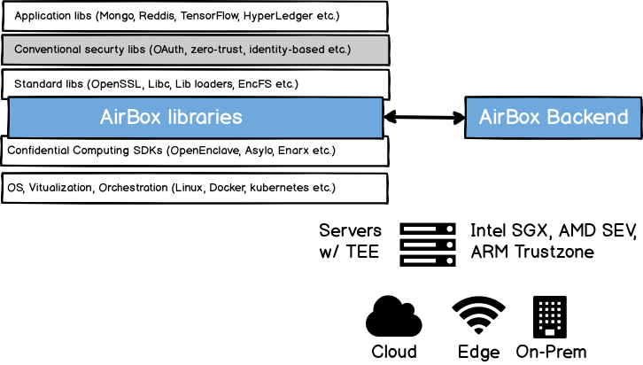

########
Overview
########

What is AirBox?
###############

AirBox is an easy to use, flexible, low latency open source platform that provides confidential computing for applications in any cloud or at any edge. AirBox bakes security seamlessly in to the applications and fortifying them their execution, access to storage and encrypted communications using processor shielded execution support. 

Confidential Computing
######################
Confidential Computing is referred to the set of security technologies focused on securing data in use in the cloud and at the edge. By doing so, the goal is to reduce exposure for sensitive data and provide greater control and transparency for cloud and edge users. Current approaches in cloud and edge address data at rest and in transit but encrypting data in use is considered the third and possibly most challenge step to providing a fully encrypted lifecycle for sensitive data. 

The need for greater assurances and controls in cloud and edge is driven by the critical or sensitive nature of IP and workload data. At cloud, the driver industries verticals include finance, healthcare, oil and mining, blockchain etc. At edge, they include industrial automation, self driving cars, drone control, AR/VR, etc. Applications for all of these verticals use or are based on a one or more of the technologies like AI/ML, blockchain, 5G, etc. each of which needs greater level of security posed to be satisfied by confidential computing.     

Confidential computing will cater to those needs by enabling encrypted data to be processed in memory without exposing it to the rest of the system including operating systems. It requires support shielded execution environments (SEE), also referred to as trusted execution environment (TEE) in hardware processors (like Intel SGX, AMD SEV, ARM trustzone) to deliver that.

From existing security, the key difference lies in the threat model which in confidential computing puts privileged system software outside trust. In other words, confidential computing provides security from an advanced adversary with root privileges e.g., malicious insider, hacker leveraging zero day vulnerability, etc.

Why you need AirBox?
####################
Confidential computing is certainly a giant step in right direction for cloud/edge security. However, using confidential computing for your application is still difficult, prone to pitfalls, incurs high performance and development overheads. Wouldn’t it be easier if this was handled by a system?

Thats where AirBox comes to the rescue. AirBox provides you with a framework to use confidential computing in your applications. It take cares of the complexity associated with developing, migrating, deploying and monitoring your applications in confidential computing infrastructure --  be it in any of the public cloud or edge that support confidential computing or your own data center. For example, AirBox can easily secure your existing cloud applications.

What can AirBox do?
##################
AirBox provides you with:

* *Flexibility*: AirBox provides a complete toolkit to plan your DevSecOps for confidential computing. It includes
  - analyzer that scores portions of your apps based on their potential security risk 
  - sdk libraries to develop applications from scratch
  - runtime libraries for unmodified container based micro-services
  - backend app for on-prem deployment or as a cloud service with inbuilt monitoring
* *Complete security*: AirBox provides complete security for your applications by providing extentions for:
  - secure execution extensions for remotely attested, secure execution w/ memory encryption inside hardware enclaves 
  - secure storage extensions a simple, flexible key-value store to provide exclusive sealed storage 
  - secure protocol extensions to ensure confidentialiy of end to end encrypted communications
* *High performance*: AirBox extensions are designed to be low impact on performance. The Most unique is the
low latency encrypted connection setup which is good-to-have for cloud applications but must-have for
latency critical apps at the edge.
* *Ineroperability*: AirBox interoperates with all confidential computing cloud and edge infrastructure in addition
to support for different processor architecture support for shielded execution i.e., Intel SGX, AMD SEV, ARM trustzone etc.

What AirBox is not?
###################

AirBox is not a traditional all-inclusive cloud security solution or system but a new security solution that bake security in to the applications 
and does not place trust on operating system like previleged system components for application security. Since AirBox operates between application 
and the rest of the system (OS, hypervisor etc.) to rather extend a part of it (file system, encryption protocols, loading), some generally 
used application frameworks with airbox-inside are provided as a part of it (such as Tensorflow, Unity, Apache server, etc.) However, these 
solutions are optional and other similar frameworks can be easily integrated with AirBox. AirBox provides the building blocks for building 
confidential computing platforms, but preserves user choice and flexibility where it is important.
AirBox:

* Does not limit the types of applications supported. AirBox aims to support an extremely diverse variety of applications. If an application can run in a container, it should run great with AirBox.
* Does not develop source code and does not build your application. Continuous Integration, Delivery, and Deployment (CI/CD) workflows remain at organizational preferences as well as technical requirements.
* is not a key management, identity or network segmentation solution for your cloud apps. However, the network encryption key management is not required when using AirBox for secure end to end encryption connections.
* Does not dictate logging, monitoring, or alerting and other perimeter based security solutions and provides an inbuilt, zero-cost fine granularity monitoring that can be integrated with existing solutions.
* Does not limit the virtualization type used to run your applications. AirBox is flexible to be integrated with VMs or containers.
* Does not limit the processor architecture on which your applications run as long as shielded execution environment or trusted execution environment is supported and enabled in the processor. The security provided by AirBox is a function of processor support though.

.. confidentialcomputing.io_:https://confidentialcomputing.io/

